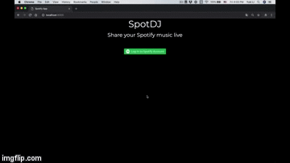

# SpotDJ

This is a serverless web app that enables anyone with a Spotify account to listen for someone else Spotify music being played live.

Try it live at www.spotDJ.com



The Spotify APIs and authentications are accessed through OneGraph.


## Running Project Locally

Install dependencies:

```
yarn
```

Send introspection query to access the queries provided by OneGraph
This will generate a graphql_schema.json which will be used to safely type your GraphQL queries/mutations.

```
yarn send-introspection-query https://serve.onegraph.com/dynamic?app_id=bafd4254-c229-48c2-8c53-44a01477a43e
```

Start the server:

```
yarn server

# in another tab
yarn start
```

View the app at http://localhost:8000. Running in this environment provides hot reloading and support for routing; just edit and save the file and the browser will automatically refresh.
