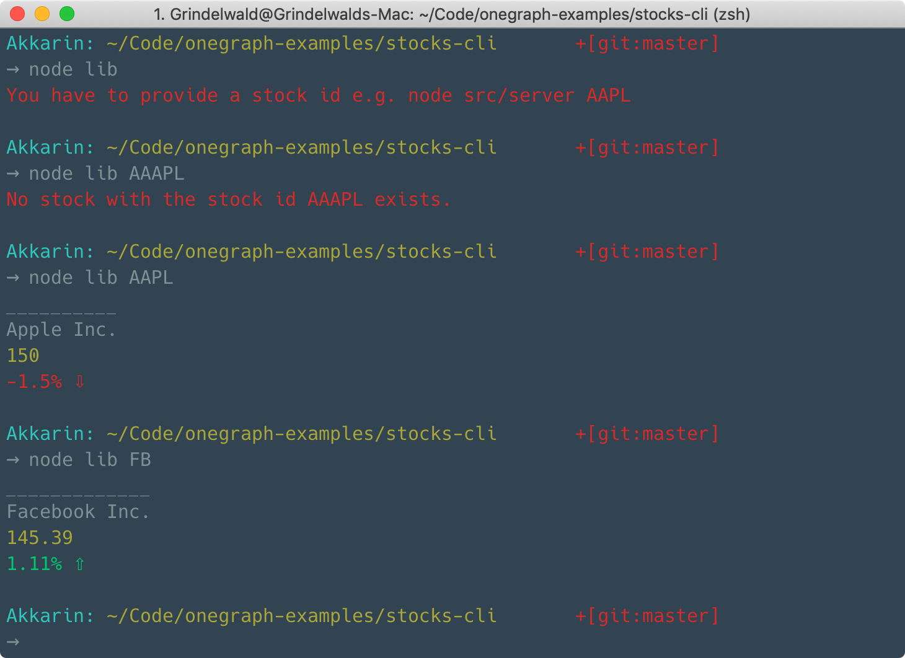

# Stocks CLI

Stocks CLI is a small, simple CLI tool that fetches stock market information using OneGraph.




## Running locally
Before running locally, we have to add a `env.js` file that exports our OneGraph API_ID. In order to get one, simply log in to your *OneGraph Dashboard* and choose an existing app or create a new one and copy its App Id in the *Settings* panel.

##### env.js
```javascript
export const APP_ID = /* ID */
```

Now we can run the app using the following commands:
```sh
yarn
yarn build

# e.g. node lib sgrove
node lib [userName]
```

## How it works

When calling the entry file using `node` it reads the stock id argument from the CLI input and fetches the stock information.

The query is as simple as this:
```graphql
query stockInfo($stockId: String!) {
  stockDemo {
    quote(ticker: $stockId) {
      changePercent
      latestPrice
      companyName
    }
  }
}
```