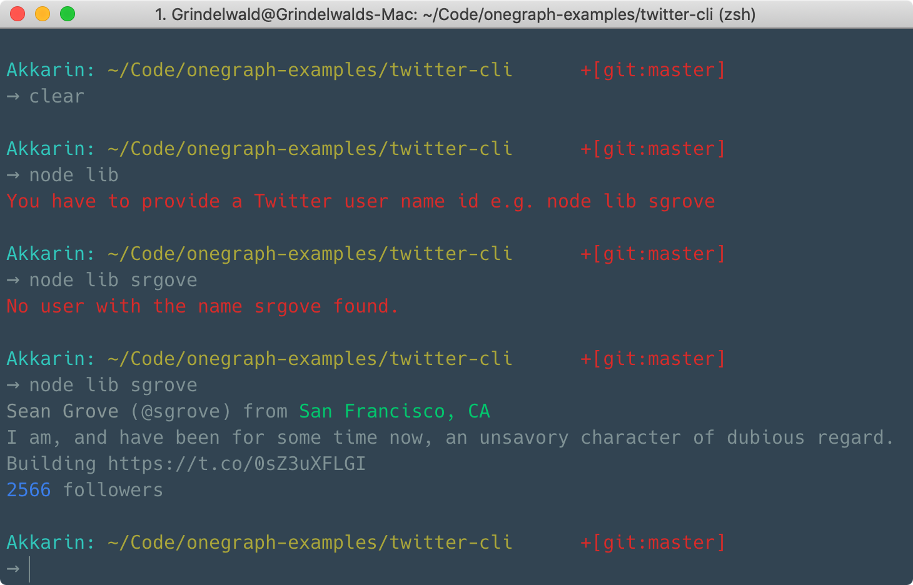

# Twitter CLI

Twitter CLI is a small, simple CLI tool that fetches Twitter user information using OneGraph.




## Running locally
Before running locally, we have to add a `env.js` file that exports our OneGraph API_ID. In order to get one, simply log in to your *OneGraph Dashboard* and choose an existing app or create a new one and copy its App Id in the *Settings* panel.
It also requires a server-side AUTH_TOKEN which can be created in the *OneGraph Dashboard* as well. Make sure to select Twitter there. 

##### env.js
```javascript
export const APP_ID = /* ID */
export const AUTH_TOKEN = /* AUTH TOKEN */
```

Now we can run the app using the following commands:
```sh
yarn
yarn build

# e.g. node lib sgrove
node lib [userName]
```

## How it works

When calling the entry file using `node` it reads the userName argument from the CLI input and fetches the Twitter information. It passes the server-side authentication token to authenticate with OneGraph and Twitter.

The query is as simple as this:
```graphql
query twitterInfo($userName: String!) {
  twitter {
    user(screenName: $userName) {
      screenName
      followersCount
      name
      location
      description
    }
  }
}
```