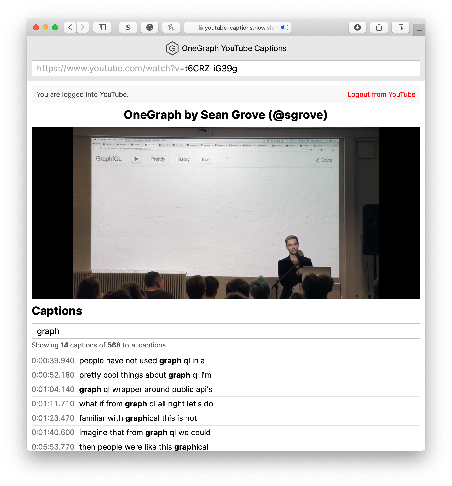

# [Youtube Captions](https://youtube-captions.now.sh)

Youtube Captions is a service that provides interactive captions for a given [YouTube](https://youtube.com) video id.



## Stack
PackageInfo is built with a set of modern web technologies.

* [OneGraph](https://www.onegraph.com): A service that seamlessly connects many services in a single GraphQL API. It provides all the package information from npm and Github in a single request!
* [react-onegraph](https://github.com/rofrischmann/react-onegraph): React Bindings for OneGraph's [Authentication Client](https://www.onegraph.com/docs/logging_users_in_and_out.html).
* [React](http://reactjs.org): A library for component-based user interfaces.
* [Next](http://nextjs.org): A framework for React-powered web applications.
* [next-css](https://github.com/zeit/next-plugins/tree/master/packages/next-css): A Next plugin to directly import CSS files.
* [Now](https://zeit.co): A platform for serverless application deployment used to serve PackageInfo.
* [Apollo](https://www.apollographql.com): A leading client for GraphQL backends that connects OneGraph with PackageInfo.
* [react-player](https://github.com/CookPete/react-player): A React component that plays videos from various video service *e.g. Youtube*.

## Sharing links
Pasting a video id will automatically update the URL to include it in order to share it e.g.
```url
https://youtube-captions.now.sh/?videoId=t6CRZ-iG39g
```

## Running locally
Before running locally, we have to add a `env.js` file that exports our OneGraph API_ID. In order to get one, simply log in to your *OneGraph Dashboard* and choose an existing app or create a new one and copy its App Id in the *Settings* panel. 

##### env.js
```javascript
export const APP_ID = /* ID */
```

Now we can run the app using the following commands:
```sh
yarn
yarn dev
```
To run in production (for deployments), we have to run:
```sh
yarn build
yarn start
```

## How it works

Whenever the video id input changes, the UI updates its state and the Apollo client triggers a new request to OneGraph that receives all the relevant data for a youtube video. Here's what the query looks like:

```graphql
query VideoWithCaptionsQuery($videoId: String!) {
  youTube {
    video(id: $videoId) {
      id
      snippet {
        title
      }
      captions {
        items {
          snippet {
            language
            status
          }
          body
        }
      }
    }
  }
}
```
OneGraph itself triggers 3 requests to YouTube's API in order to collect the data.<br>
It also handles the YouTube authorization that is required to access data from YouTube. All the client has to do is calling the login function that is provided by [onegraph-auth](https://www.onegraph.com/docs/logging_users_in_and_out.html#log-the-user-in).

## Explore the source

#### Folders
- [components](src/components/): Presentational UI components
- [integration](src/integration/): Apollo setup
- [pages](src/pages/): Pages for Next
- [sections](src/sections/): Different UI sections
----- 

#### OneGraph
- [src/pages/_app.js](src/pages/_app.js): Passing our appId to the react-onegraph's AuthProvider

#### Apollo
- [src/integration/apolloClient.js](src/integration/ApolloClient.js): Apollo setup including the authorization headers
- [src/pages/index.js](src/pages/index.js): The app entry point including the Apollo Query component and the GraphQL query